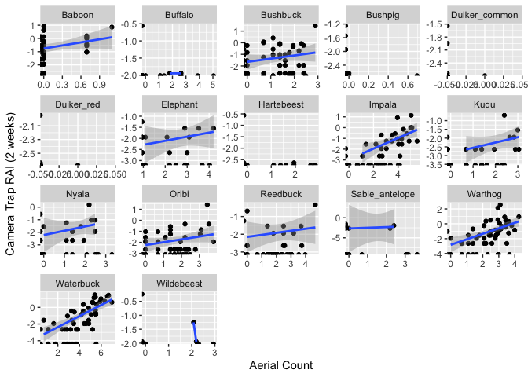
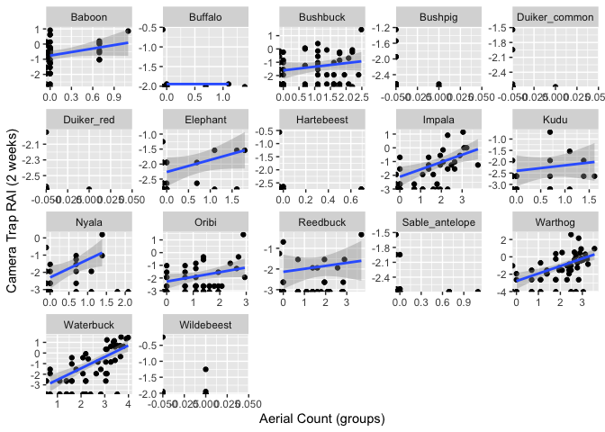
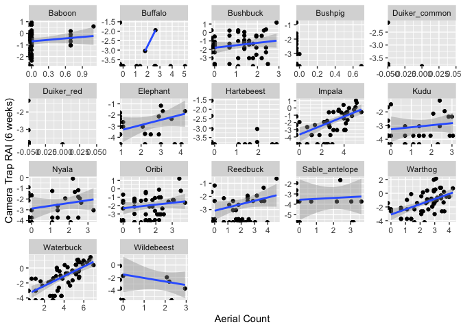
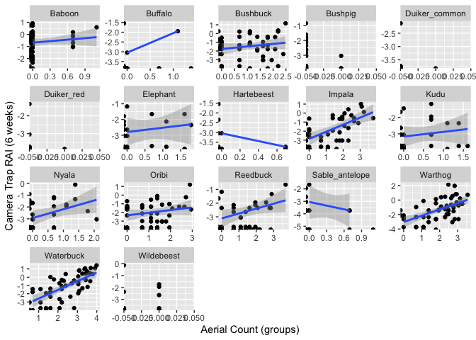
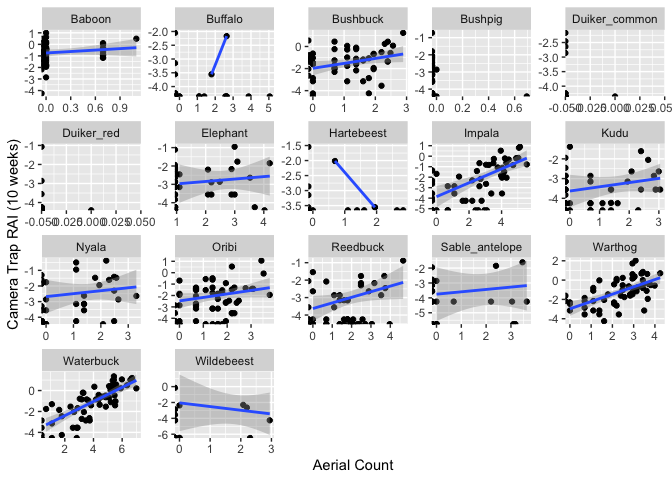
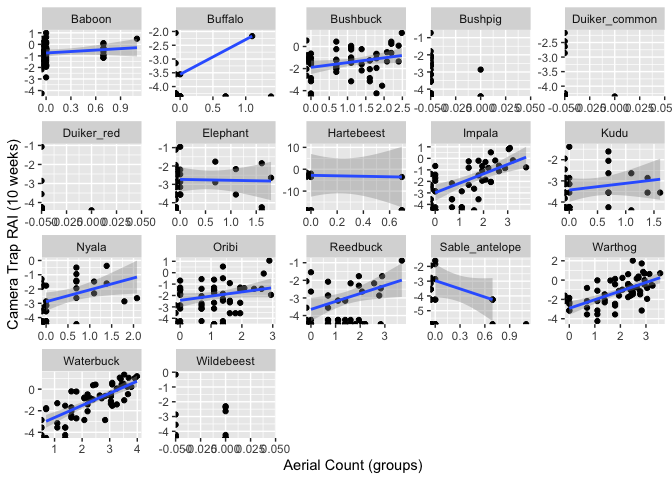
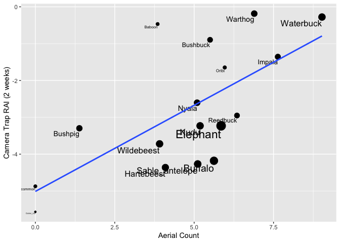
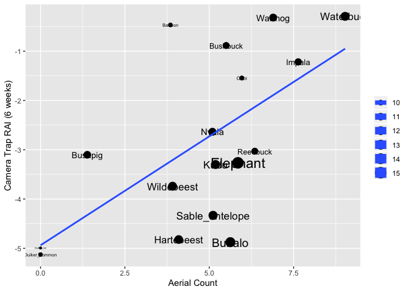
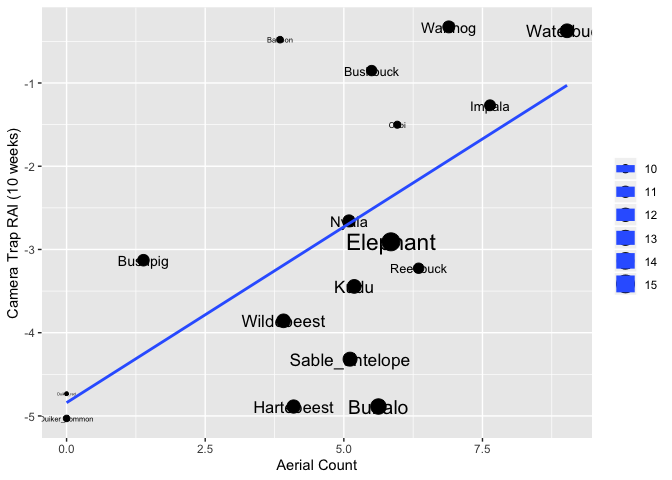

The general approach
--------------------

I was interested in comparing aerial count detections to camera trap
detections during the same period (late dry season of 2016). I was
curious to see which species were more commonly detected in one vs. the
other, and how the ratio of aerial to camera trap detections varied
across habitats and species.

I cropped the 2016 aerial count data to the camera trap grid. For each
species in the aerial count, I tallied up the number of individual
animals counted in each of the 60 hexagonal grid cells. (I also counted
the number of groups, but am not showing those analyses below, because
Marc Stalmans informed me that multiple groups were often lumped
together during the count for the sake of efficiency, particularly for
common species. Also, the individual vs group aerial counts are highly
correlated, so the patterns were similiar regardless of which was used
as an aerial count measure.)

Here is a map showing the aerial count records within the grid:

I then calculated the Relative Activity Index, a simple measure of
camera trap detections per night. Here, I considered records to be
independent if they were &gt;10 minutes from a record of the same
species at that location. I did not record the number of individuals in
each group, so in this case, we are looking at groups—an imperfect
comparison with individuals from the aerial count, but the best that we
can do so far. Meredith is currently working on determining the number
of individuals in each record.

The aerial survey took place from October 18-31, 2016. I calculated RAI
for three different time periods:

-   the exact period of the survey (2 weeks total)
-   two weeks before and after the count (6 weeks total)
-   four weeks before and after the count (10 weeks total). The longer
    the camera trap survey period, the more data, but I didn't want it
    to be so long that it was no longer representative of animal
    distributions during the count.

For each of these three time periods, I calculated RAI for each species:

-   within each grid cell
-   within the entire study area

Detections within each grid cell with aerial vs. camera surveys
---------------------------------------------------------------

First, I looked at whether or not each species was detected in each of
the 60 grid cells in the aerial and/or camera trap records. Note that
this list only includes species detected in the aerial survey. There
were a number of species that were not counted in the aerial survey but
which were present in the camera traps (including all of the carnivore
species).

These figures indicate the number of grid cells in which the species was
detected in both aerial and camera surveys (YAer\_Y\_Cam), in neither
survey (NAer\_N\_Cam), ONLY camera trap (NAer\_YCam), and ONLY aerial
(YAer\_NCam). The top plot is based on the 2-week camera survey, and the
bottom on the 10-week survey. As would be expected, the detections of
species increase over a longer survey period.

    ## Saving 7 x 5 in image

    ## Saving 7 x 5 in image

    ## Saving 7 x 5 in image

Some observations based on the 10-week period:

Species that are more often detected on aerial surveys but missed on
camera traps include:

-   Reedbuck
-   Buffalo
-   Oribi
-   Wildebeest
-   Hartebeest
-   Impala

Some traits shared by many of these species include their medium/large
body size, group formation, and preference for open habitat. These
traits may make them more likely to be detected in the aerial survey.

Species that are more often detected on camera traps but missed on
aerial surveys include:

-   Baboon
-   Bushbuck
-   Bushpig
-   Common duiker
-   Red duiker
-   Kudu
-   Nyala
-   Elephant

These species tend to be more solitary and nocturnal, with smaller
bodies, and found in more densely-wooded areas. As a result, they may be
missed during the aerial survey.

Note that the observed elephant pattern is likely because they are
highly mobile and are counted across multiple camera grid cells in the
10-week period.

Waterbuck and warthog are ubiquitous and nearly universally-detected
(though as discussed below, many more warthogs are picked up in the
camera traps than aerial survey).

Comparing relative number of aerial and camera detections within grid cells
---------------------------------------------------------------------------

Here is the correlation between the aerial count (number of individuals)
and camera trap RAI, where each point represents one of the 60 grid
cells. These plots are on a log scale for easier interpretation. This
plot is shown for the 2-week window that occurred only during the aerial
count, but the patterns look similar for the 6- and 10-week periods
also.

    ## Saving 7 x 5 in image

    ## Saving 7 x 5 in image

    ## Saving 7 x 5 in image

    ## Saving 7 x 5 in image

    ## Saving 7 x 5 in image

    ## Saving 7 x 5 in image

You see that there is generally a positive relationship between
detections on the aerial count and in the camera trap, though not a very
clean relationship. It appears stronger for some species (waterbuck,
warthog, impala) and weaker for others (nyala, bushbuck, reedbuck).

Comparing aerial and camera detections for different species
------------------------------------------------------------

Then, I looked at overall correlation between aerial survey count and
camera trap detections across the entire study area (all grid cells
combined). I was interested in seeing how the ratio between the two
counts varied among species. The size of the point corresponds to the
size of the animal.

It appears that larger-bodied animals are relatively more detected in
the aerial counts, as compared to the camera traps. Another way of
looking at the same thing: here is the ratio of aerial count to RAI, as
a function of body weight. A higher ratio means that the species was
relatively more detected on the aerial counts.

    ## Saving 7 x 5 in image

    ## Saving 7 x 5 in image

    ## Saving 7 x 5 in image

So species like buffalo, sable, reedbuck, waterbuck, elephant, impala
are picked up relatively more on the aerial surveys. Common duiker, red
duiker, baboon, bushpig, bushbuck, warthog are picked up relatively more
on the camera traps. This pattern of relative detection rates echoes
what was seen above with the presence/absence comparison.

Detection and tree cover
------------------------

I was curious to know if the tree cover in a given grid cell changed the
relative patterns of detection based on the aerial count vs. camera
traps, with the hypothesis that camera traps would pick up more animals
in wooded areas where visibility from helicopter may be lower.

I only just began these analyses; ideally, I would want to calculate
average tree cover within the entire grid cell, but this analysis was
very computationally-intensive given the high-resolution rasters, so for
now I just took the tree cover value at the camera location in the
center of the grid cell.

Another important caveat: this only includes grid cells in which the
species was detected in both aerial and camera surveys (since ratio
would be 0 or infinity, which was messing up the regression). So
interpret with caution.

And given all of those caveats, the initial graphs don't show much. It
seems that tree cover has little bearing on the relationship between
aerial vs. camera detections, but again, this is preliminary.

    ## Saving 7 x 5 in image

    ## Saving 7 x 5 in image

    ## Saving 7 x 5 in image
